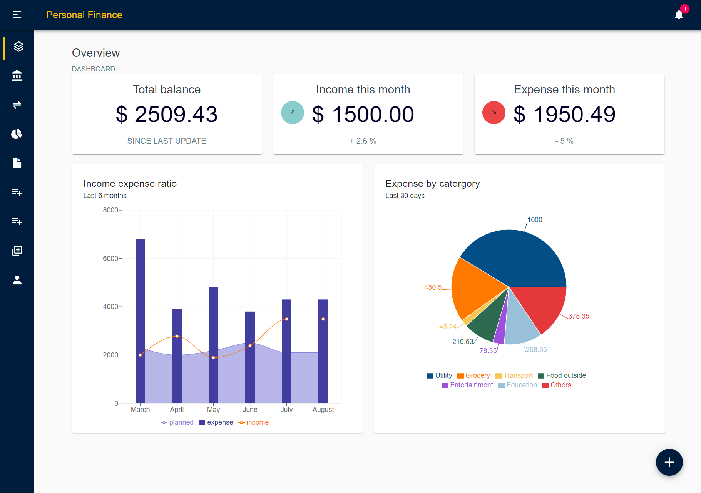
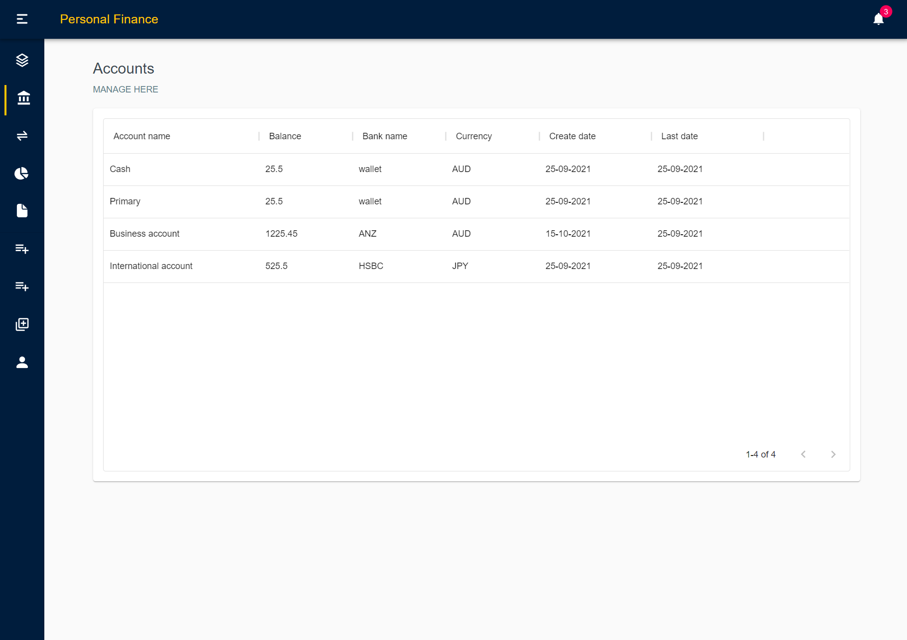
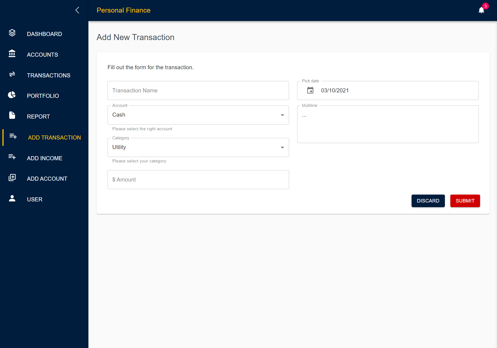

# Personal Finance (Frontend)
A fullstack application for tracking users accounts, earning and expenses in one app. 

 

### UI preview
Following are some sample frontend user interfaces for the application.

 Screenshot: Dashboard page

 Screenshot: Data tables page

 Screenshot: Add data forms page

 

### Tools used in the project:
Frontend: ReactJS, React-router, React-icons, Recharts, Axios, Material-UI library.